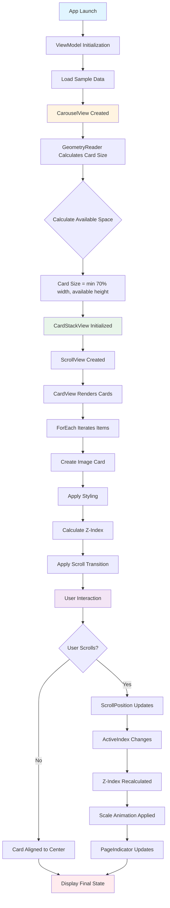

# Layered 3D Carousel - Technical Documentation

## Table of Contents
1. [Overview](#overview)
2. [Functional Requirements](#functional-requirements)
3. [Architecture & Approach](#architecture--approach)
4. [UI Design Flowchart](#ui-design-flowchart)
5. [SwiftUI APIs Used](#swiftui-apis-used)
6. [Component Structure](#component-structure)
7. [Implementation Details](#implementation-details)

---

## Overview

Layered 3D Carousel is a SwiftUI-based iOS application that displays a horizontally scrollable carousel of cards with a 3D layered effect. The carousel features smooth scrolling animations, automatic card alignment, and visual depth through z-index layering.


---

## Functional Requirements

### Core Features

1. **Horizontal Scrolling Carousel**
   - Display multiple cards in a horizontal scrollable view
   - Cards should overlap with negative spacing (-24 points)
   - Smooth scrolling with momentum

2. **3D Layered Effect**
   - Active (center) card should appear on top with highest z-index
   - Cards further from center should have lower z-index
   - Visual depth through layered stacking

3. **Card Alignment**
   - Automatic alignment of cards to center position
   - Snap-to-center behavior when scrolling stops
   - Initial card position set to index 1

4. **Visual Feedback**
   - Scale animation during scroll transitions
   - Page indicator showing current active card
   - Smooth animations using spring physics

5. **Responsive Design**
   - Dynamic card sizing based on available screen space
   - Card size calculated as: `min(70% of width, available height)`
   - Minimum card size of 1 point to prevent layout issues

6. **Card Content**
   - Image display with aspect ratio fill
   - Title overlay at bottom-leading position
   - Rounded corners and shadow effects

---

## Architecture & Approach

### Design Pattern
- **MVVM (Model-View-ViewModel)**: Separates business logic from UI
- **Component-Based Architecture**: Modular, reusable SwiftUI views
- **Declarative UI**: SwiftUI's declarative syntax for UI construction

### Component Hierarchy

```
ContentView
└── CarouselView
    ├── CardStackView
    │   └── CardView
    │       └── CardOverlay
    └── PageIndicator
```

### State Management

- **ViewModel**: Manages carousel data (`@Published var carouselItems`)
- **CarouselView**: Manages active index state (`@State private var activeIndex`)
- **CardStackView**: Manages internal appearance state (`@State private var didAppear`)
- **Bindings**: Two-way data flow between parent and child views

### Data Flow

1. **ViewModel** provides initial data via `sampleData()`
2. **CarouselView** receives data binding from ViewModel
3. **CardStackView** receives activeIndex and carouselItems bindings
4. **CardView** renders individual cards based on items array
5. **ScrollPosition** updates activeIndex when user scrolls
6. **PageIndicator** reflects current activeIndex

---

## UI Design Flowchart



### Visual Layout Flow

```
┌─────────────────────────────────────┐
│         CarouselView                │
│  ┌───────────────────────────────┐  │
│  │     CardStackView            │  │
│  │  ┌─────────────────────────┐ │  │
│  │  │   ScrollView (Horizontal)│ │  │
│  │  │  ┌───────────────────┐  │ │  │
│  │  │  │  HStack (spacing:-24)│ │ │  │
│  │  │  │  ┌──┐ ┌──┐ ┌──┐   │  │ │ │  │
│  │  │  │  │C1│ │C2│ │C3│... │  │ │ │  │
│  │  │  │  └──┘ └──┘ └──┘   │  │ │ │  │
│  │  │  └───────────────────┘  │ │  │
│  │  └─────────────────────────┘ │  │
│  └───────────────────────────────┘  │
│  ┌───────────────────────────────┐  │
│  │    PageIndicator              │  │
│  │    ● ● ● ● ●                  │  │
│  └───────────────────────────────┘  │
└─────────────────────────────────────┘
```

---

## SwiftUI APIs Used

### 1. `scrollTargetBehavior(_:)`
**Location**: `CardStackView.swift:27`

```swift
.scrollTargetBehavior(.viewAligned)
```

**Purpose**: Configures the scroll view to automatically align views to specific positions when scrolling ends.

**Behavior**:
- Snaps cards to center position after scroll gesture ends
- Provides smooth, predictable card alignment
- Works in conjunction with `scrollPosition(id:)` to determine which view to align

**iOS Version**: iOS 17.0+

---

### 2. `scrollTargetLayout()`
**Location**: `CardView.swift:37`

```swift
.scrollTargetLayout()
```

**Purpose**: Marks a layout container as a target for scroll alignment behavior.

**Behavior**:
- Identifies the `HStack` as the container for scroll targets
- Enables `scrollTargetBehavior` to work with child views
- Required for `scrollPosition(id:)` to track individual card positions

**iOS Version**: iOS 17.0+

---

### 3. `scrollTransition(_:)`
**Location**: `CardView.swift:29-32`

```swift
.scrollTransition { content, phase in
    content
        .scaleEffect(y: phase.isIdentity ? 1 : 0.7)
}
```

**Purpose**: Applies visual transitions to views as they scroll relative to a target position.

**Parameters**:
- `content`: The view content to transform
- `phase`: `ScrollTransitionPhase` indicating scroll position
  - `.identity`: View is at target position (full scale)
  - `.topLeading`: View is before target (scaled down)
  - `.bottomTrailing`: View is after target (scaled down)

**Behavior**:
- Cards scale vertically (y-axis) from 0.7 to 1.0 based on scroll position
- Creates depth effect as cards move away from center
- Smooth interpolation between states

**iOS Version**: iOS 17.0+

---

### 4. `scrollClipDisabled()`
**Location**: `CardStackView.swift:28`

```swift
.scrollClipDisabled()
```

**Purpose**: Disables clipping of content that extends beyond the scroll view's bounds.

**Behavior**:
- Allows cards to extend beyond scroll view edges
- Enables overlapping card effect
- Prevents content from being cut off at boundaries
- Essential for layered carousel design

**iOS Version**: iOS 17.0+

---

### 5. `scrollPosition(id:)`
**Location**: `CardStackView.swift:25`

```swift
.scrollPosition(id: $activeIndex)
```

**Purpose**: Binds the scroll position to a state variable, tracking which view is currently at the target position.

**Behavior**:
- Two-way binding: updates `activeIndex` when user scrolls
- Can programmatically scroll by setting `activeIndex`
- Works with `.id()` modifier on child views
- Enables scroll position tracking and programmatic control

**Parameters**:
- `id`: Binding to the identifier of the view at target position

**iOS Version**: iOS 17.0+

---

### 6. `contentMargins(_:for:)`
**Location**: `CardStackView.swift:26`

```swift
.contentMargins(50, for: .scrollContent)
```

**Purpose**: Adds margins to the scrollable content area.

**Behavior**:
- Adds 50 points of padding on all sides of scroll content
- Prevents first/last cards from touching screen edges
- Improves visual spacing and user experience
- Only affects scrollable content, not scroll indicators

**iOS Version**: iOS 17.0+

---

### 7. `GeometryReader`
**Location**: `CarouselView.swift:15`

```swift
GeometryReader { proxy in
    let cardSize = max(min(baseWidth, availableHeight), 1)
    // ...
}
```

**Purpose**: Provides access to the parent view's size and coordinate space.

**Usage**:
- Calculates dynamic card size based on available space
- Responsive design: adapts to different screen sizes
- Formula: `min(70% of width, available height)`

---

### 8. Additional SwiftUI Modifiers

#### `zIndex(_:)`
**Location**: `CardView.swift:33`

```swift
.zIndex(layerOrder(for: index, activeIndex: activeIndex))
```

**Purpose**: Controls the stacking order of views.

**Implementation**:
- Active card: z-index = 10.0
- Distance 1: z-index = 9.0
- Distance 2: z-index = 8.0
- Creates 3D layered effect

---

#### `id(_:)`
**Location**: `CardView.swift:34`

```swift
.id(item.id)
```

**Purpose**: Provides stable identity for views in ForEach.

**Benefits**:
- Enables `scrollPosition(id:)` to track specific cards
- Prevents view identity issues during updates
- Uses `CarouselItem.id` for unique identification

---

#### `scrollTransition` Phase Values

```swift
enum ScrollTransitionPhase {
    case identity      // At target position
    case topLeading    // Before target
    case bottomTrailing // After target
}
```

---

## Component Structure

### 1. CarouselView
**File**: `Components/CarouselView.swift`

**Responsibilities**:
- Main container view
- Calculates responsive card size
- Manages activeIndex state
- Coordinates CardStackView and PageIndicator

**Properties**:
- `@State private var activeIndex: Int?`
- `@Binding var carouselItems: [CarouselItem]`

---

### 2. CardStackView
**File**: `Components/CardStackView.swift`

**Responsibilities**:
- Wraps ScrollView with horizontal scrolling
- Manages scroll position tracking
- Handles initial card positioning
- Applies scroll behavior modifiers

**Properties**:
- `@Binding var activeIndex: Int?`
- `@Binding var carouselItems: [CarouselItem]`
- `let cardSize: Double`
- `@State private var didAppear: Bool`

---

### 3. CardView
**File**: `Components/CardView.swift`

**Responsibilities**:
- Renders individual card items
- Applies scroll transitions
- Calculates z-index layering
- Manages card layout in HStack

**Properties**:
- `@Binding var items: [CarouselItem]`
- `@Binding var activeIndex: Int?`
- `let cardSize: Double`

---

### 4. CardOverlay
**File**: `Components/CardOverlay.swift`

**Responsibilities**:
- Displays card title
- Provides consistent styling
- Reusable overlay component

**Properties**:
- `let title: String`

---

### 5. PageIndicator
**File**: `Components/PageIndicator.swift`

**Responsibilities**:
- Visual indicator of current position
- Animated dot transitions
- Shows total number of items

**Properties**:
- `var currentIndex: Int`
- `var totalItems: Int`

---

### 6. ViewModel
**File**: `ViewModel.swift`

**Responsibilities**:
- Manages carousel data
- Provides sample data
- ObservableObject for data binding

**Properties**:
- `@Published var carouselItems: [CarouselItem]`

---

### 7. CarouselItem
**File**: `Model/CarouselItem.swift`

**Structure**:
```swift
struct CarouselItem: Identifiable, Equatable {
    let id: Int
    let name: String
    let image: String
}
```

---

## Implementation Details

### Z-Index Calculation

The `layerOrder` function calculates z-index based on distance from active card:

```swift
func layerOrder(for index: Int, activeIndex: Int?) -> Double {
    guard let activeIndex else { return 0 }
    let distance = abs(Double(index - activeIndex))
    let zIndex = 10.0 - distance
    return max(zIndex, .leastNonzeroMagnitude)
}
```

**Example**:
- Active card (index 2): z-index = 10.0
- Adjacent cards (index 1, 3): z-index = 9.0
- Distance 2 (index 0, 4): z-index = 8.0

---

### Card Size Calculation

```swift
let availableHeight = max(proxy.size.height, 0)
let baseWidth = max(proxy.size.width - 100, proxy.size.width * 0.7)
let cardSize = max(min(baseWidth, availableHeight), 1)
```

**Logic**:
1. Calculate 70% of available width
2. Subtract 100 points for margins
3. Take minimum of width and height
4. Ensure minimum size of 1 point

---

### Scroll Transition Animation

The scroll transition creates a depth effect:

```swift
.scrollTransition { content, phase in
    content
        .scaleEffect(y: phase.isIdentity ? 1 : 0.7)
}
```

**Animation States**:
- **Identity** (center): Full scale (1.0)
- **Off-center**: Scaled down (0.7)
- **Smooth interpolation** between states

---

### Initialization Flow

1. `CardStackView.onAppear` sets `activeIndex = 1`
2. `scrollPosition(id:)` scrolls to card with id = 1
3. `scrollTargetBehavior` aligns card to center
4. Z-index and transitions apply based on position

---

## Key Design Decisions

1. **Negative Spacing (-24)**: Creates overlapping card effect
2. **Initial Index = 1**: Starts at second card for better UX
3. **Dynamic Sizing**: Responsive to screen size
4. **Component Extraction**: CardOverlay for reusability
5. **Internal State Management**: didAppear managed internally

---

## Requirements

- **iOS**: 17.0+
- **Xcode**: 15.0+
- **Swift**: 5
- **SwiftUI**: Framework

---

## Future Enhancements

1. Infinite scrolling support
2. Customizable card spacing
3. Configurable animation curves
4. Accessibility improvements
5. Performance optimizations for large datasets

---

## Author

Created by shilpee.gupta
